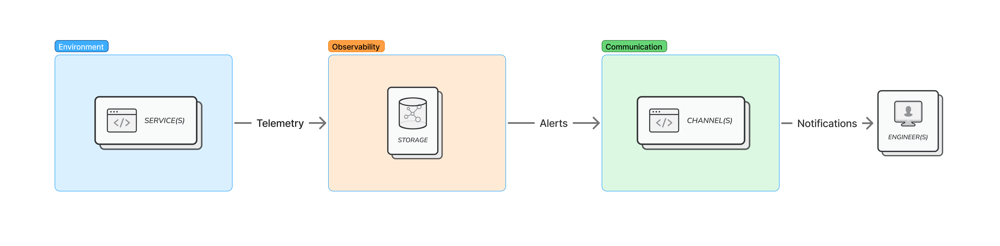
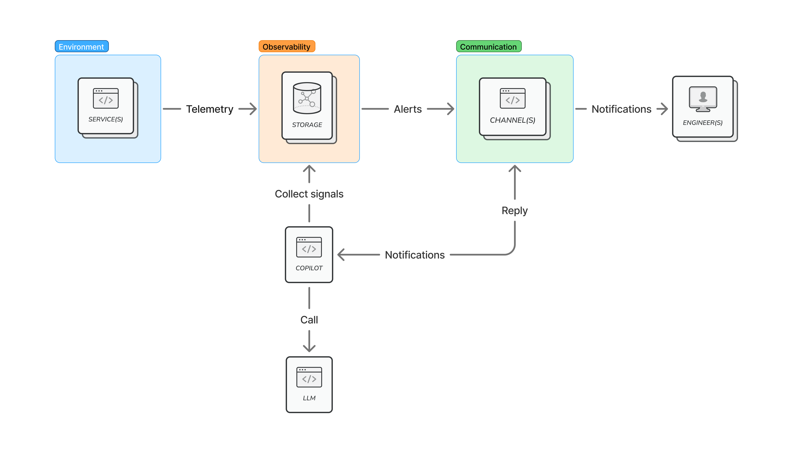
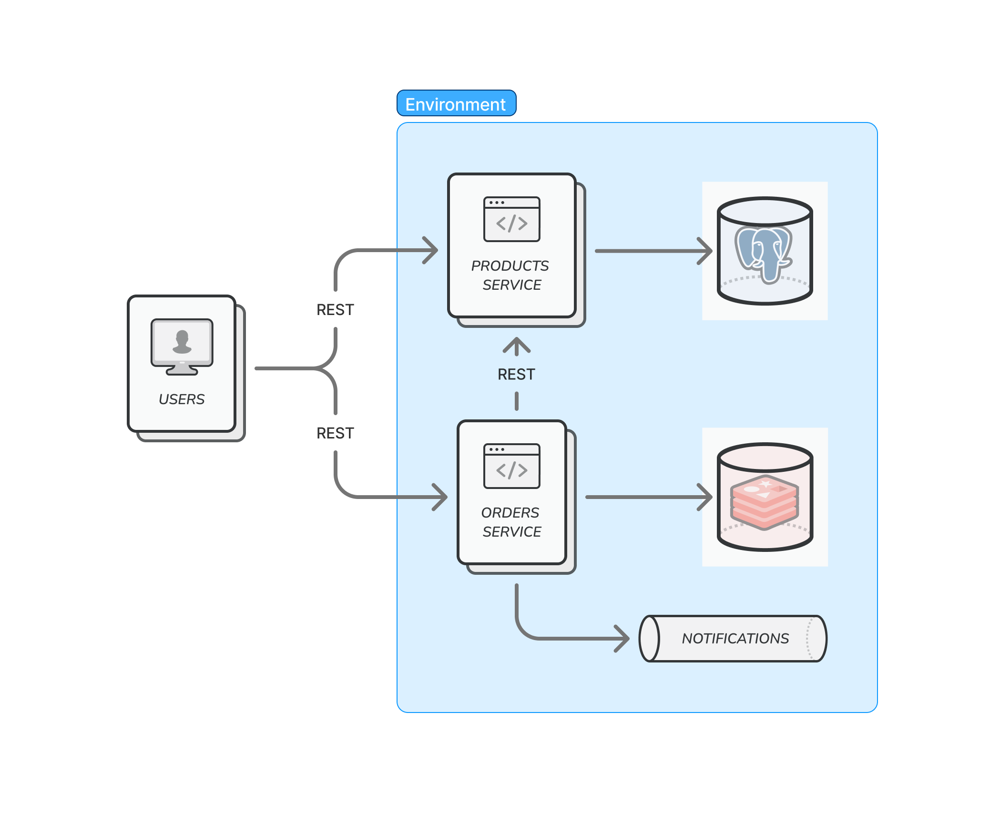

# OpenTelemetry Copilot: Root Cause Analysis

### Abstract
This blog post opens a short series of articles about applying Large Language Models (LLM) to use it for analyzing observability
data supplied by OpenTelemetry (OTEL) framework. The main goal the series is trying to achieve is to find out how to use LLM
to help automate or help in resolving tedious and repetitive work such as incident response, root cause analysis and 
post-mortem investigations.

Although LLMs play a central role in a final solution, a number of related frameworks, such as Agents and Model Context Protocol (MCP),
and techniques like prompt engineering will be used.

Since observability and monitoring are a wide topic, the current article focuses primarily on issues Root Cause Analysis (RCA).

### Introduction
Engineers experience multiple hardships regularly with system monitoring, such as:

- Using multiple tools. Although, a number of Application Performance Monitoring (APM) systems (Signoz, HoneyComb, etc.) 
provide a single experience to access all telemetry data in a single place, in general case, monitoring stack can be quite diverse.
- Solving repetitive problems. Plenty of production incidents look similar: third party service call timeout, invalid user input
caused error on read, service auto-scaling did not catch up with the traffic increase, 
- Solving straightforward problems. This somewhats complements the previous bullet point. In many cases problems to solve
are not just repetitive but also well-known to solve: increase timeout if possible, re-use connections, extend validation,
provision additional resources in advance.

Generally, observability setup can be described with the following diagram

where:
- `Service(s)` - one or more software components under monitoring. It can be anything under engineers' control: HTTP server, periodic task, etc.
- `Environment` - computing and storage resources where the aforementioned services are running. In particular, cloud providers, premises hardware, etc.
- `Telemetry` - telemetry data (logs, metrics and traces) produced by `Service(s)`, `Environment` or both. 
- `Observability` - observability stack. This can be a pretty wide range of tools: starting from a single APM 
to a combination of software for individual purposes (e.g. ELK only for logs, Prometheus for metrics, Jagger for traces).
- `Alerts` - signals from pre-configured triggers identifying ongoing problems with running systems, like increased latency or error rate.
- `Communication` - communication channels used by observability platform to deliver triggered alerts, such as messangers, phone, email.
- `Engineer(s)` - person- or team-responsible for running system support.

In these environments, the engineer's typical workflow could be described as follows:

- Collect signals. Depending on the context of the received alert, the first thing to do is collect initial telemetry data,
like search for error logs or check metrics spikes.
- Formulate an initial hypothesis. Based on collected data engineer can see a bigger picture and suggest clues of an issue cause.
- Further investigation. To confirm or deny first clues, it might be required to check other parts of a system out of outlined scope:
look at a database, verify connection to other services, etc.
- Take action or keep investigating. Depending on previous investigation results, either take actions (like deploy patch fix) or
repeat the loop by collecting more signals.

Of course, this is a very simplified version of the workflow process, and incidents can look way more complicated.
So far, corner cases are out of scope of this article, and we are going to focus on more regular cases.

Although, in the described workflow not everything can be automated (for instance, taking actions definitely should be performed by a human),
there is still room for potential AI assistance:
- Signals collecting - well-described monitoring alert should contain enough data (title, description, tags) to understand which signals to collect.
For instance, alert titled `Error rate for 'tickets' service 'GET /ticket/{id}' endpoint is 11% for the past 5 minutes` implies that engineer wants 
to find error logs or traces for `tickets` service, `GET` method and path `/ticket/{id}` to understand error details.
- Signals summarization — reviewing gathered signals individually usually is not efficient, and we need to draw a bigger picture.
Continuing the previous example, most likely there will be a number of similar logs, like invalid record or failed internal call to the other service.
- Next steps — after having a summary, it would be possible to outline the initial hypothesis and understand further actions.
This can range from repeating this loop to applying a patch fix.

The first two steps will be our focus for the further blog post.

### OpenTelemetry Copilot architecture and workflow
Proposed architecture in general case — abstracted over specific tools, frameworks and software.

To build automation around the alerts' initial investigation, it proposed the following high-level architecture aiming to leverage
[Agentic AI](https://en.wikipedia.org/wiki/Agentic_AI) approach.
_Please note that the following architecture is still abstracted over specific tools or implementation details. This will
be covered in the subsequent sections_ 

in comparison to the previously described observability setup there are new components and connections:
- `Copilot` - Agent that will play a role of incident investigation assistant. To be more precise: it would react on the same `Notification` 
that receives on-call engineer, then it will perform a `Call` to `Large Language Model (LLM)` service along with supplying 
connection to observability as a tool. At the end of the process, the `Copilot` would send back `Reply` that would contain result 
of initial analysis: signal summary, initial hypothesis, suggested actions, etc. 
- `LLM` - any LLM service, internally or externally deployed.

The described setup aims to simplify engineering incidents investigation workflow by eliminating a need to collect initial signals,
summarize them and jumping to initial conclusions.  

### Setup
Since architecture and workflow are outlined, it is time to zoom into each high-level component described before.
Here we will be more practical and describe specific tools, frameworks, scenarios for demonstrating and testing.

#### Environment setup: System under observability
First, we need to have some system in place to collect telemetry data from, which is the first component on high-level setup.
For the sake of testing and experimentation, let's have the following system: 

This is a microservices-based backend for a hypothetical e-commerce application, consisting of a `Products Service`
to manage inventory, an `Orders Service` to handle customer orders and send notifications. Happy path workflow is the following:
a user searches for products via the `Products Service`, then creates an order via the `Orders Service`, which verifies
product availability, creates an order and publishes a notification event to Kafka.

### References
- [RCA Copilot: Transforming Network Data into Actionable Insights via Large Language Models](https://arxiv.org/abs/2507.03224)
- [Leveraging Large Language Model for Intelligent Log Processing and Autonomous Debugging in Cloud AI Platforms](https://arxiv.org/abs/2506.17900)
- [LogAI: A Library for Log Analytics and Intelligence](https://arxiv.org/abs/2301.13415)